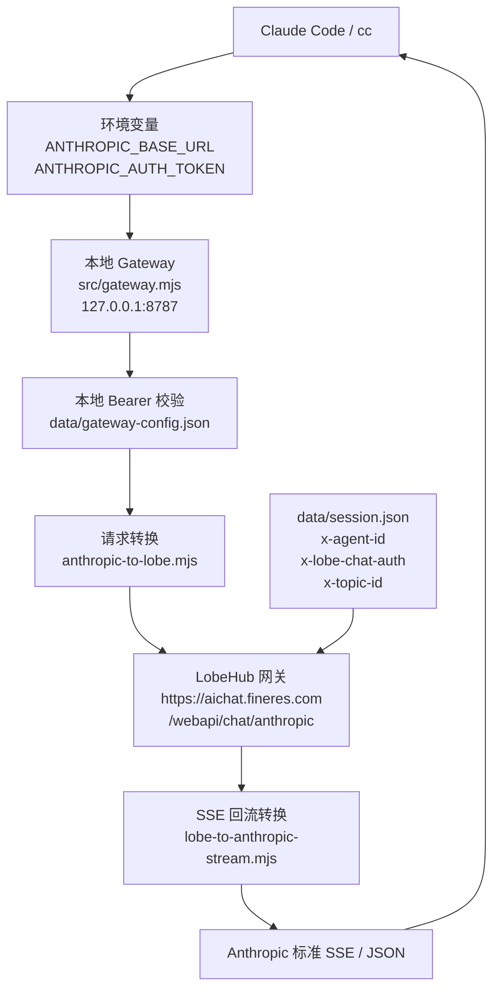

<!--
功能：说明 Claude Code 通过本地网关接入 LobeHub 的当前拓扑与原因
作者：Anner
创建时间：2026/3/26
-->

# Claude Code 接入拓扑分析

## 结论

`cc` 可以接进来，不是因为它直接兼容 `aichat.fineres.com`，而是因为当前项目在本地起了一个 **Anthropic 兼容网关**，把 Claude Code 发出的标准 Anthropic 请求，转换成了 LobeHub 的 `/webapi/chat/anthropic` 请求。

真正让链路打通的关键有四个：

1. Claude Code 支持通过环境变量改写上游地址和 Bearer Token。
2. 本地 `src/gateway.mjs` 暴露了 Claude Code 期望的 `/v1/models`、`/v1/messages`、`/v1/messages/count_tokens`。
3. 网关把 Anthropic Messages API 请求转换成 LobeHub 可接受的请求体和 SSE 流。
4. 网关会从 `data/session.json` 读取真实浏览器会话头，代替 Claude Code 去请求 `https://aichat.fineres.com/webapi/chat/anthropic`。

## 当前拓扑

## 为什么能接进来

### 1. Claude Code 被指到了本地兼容层

项目文档里已经明确给出了接入方式：

- `ANTHROPIC_BASE_URL=http://127.0.0.1:8787`
- `ANTHROPIC_AUTH_TOKEN=local-dev-token`

这意味着 `cc` 眼里看到的是一个标准 Anthropic 服务，而不是直接访问 LobeHub。

### 2. 本地网关实现了 Claude Code 需要的接口

`src/gateway.mjs` 已经提供了这些接口：

- `GET /health`
- `GET /v1/models`
- `POST /v1/messages/count_tokens`
- `POST /v1/messages`

这正是 Claude Code 常规调用 Anthropic API 时会依赖的关键入口。

### 3. 请求协议被翻译成了 LobeHub 能吃的格式

`src/lib/anthropic-to-lobe.mjs` 负责把这些内容转成 LobeHub 格式：

- `system`
- `messages`
- `tools`
- `tool_result`
- `thinking`
- `temperature/top_p/max_tokens`

所以 Claude Code 发来的标准消息体，可以被 LobeHub 侧继续处理。

### 4. 最关键的是浏览器登录态被复用了

真正访问 `aichat.fineres.com` 时，网关会注入：

- `x-agent-id`
- `x-lobe-chat-auth`
- `x-topic-id`

这些值来自 `data/session.json`，而这个文件又是通过 `src/tools/extract-session-from-har.mjs` 从浏览器 HAR 中提取出来的。

也就是说，Claude Code 自己并没有登录 LobeHub，它只是借用了你浏览器已经存在的会话身份。

## 补充判断

- 这条链路默认只监听 `127.0.0.1`，所以“能接进来”的前提是：调用方和这台机器在同一台本机环境里。
- 当前本地网关只做了一个静态 Bearer Token 校验，知道 `local-dev-token` 的本机进程理论上都能调用它。
- 只要 `data/session.json` 里的会话头还有效，Claude Code 就能持续通过本地网关访问上游。
- 一旦浏览器重新登录导致头失效，就需要重新导入 HAR 更新 `session.json`。
